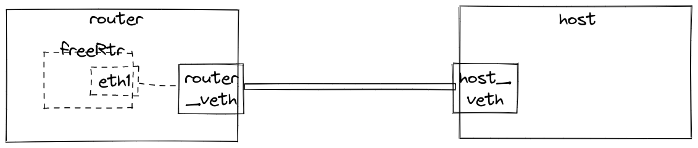
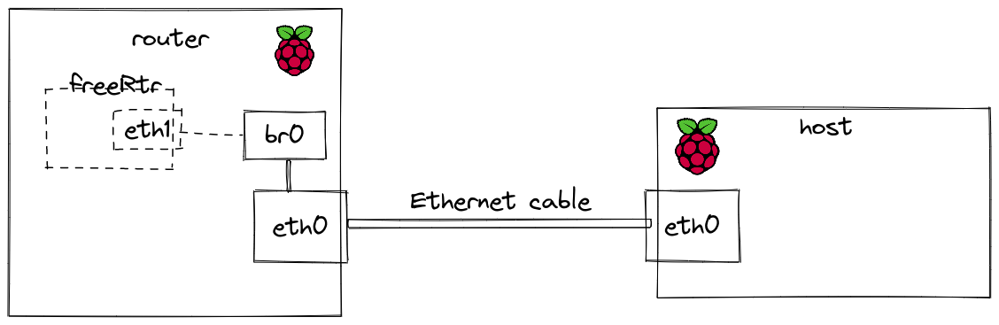

# Neighbor Discovery on FreeRTR

## FreeRTR Installation

Note: Preferably use a VM for running Freertr. We are using local VMs.

Install JRE
```bash
sudo apt-get install --no-install-recommends --no-install-suggests --yes default-jre-headless
```

Installing Freertr from Source
<br>

Cloning the repo
```bash
git clone https://github.com/rare-freertr/freeRtr.git
cd freeRtr/src/
```

Cleaning up and compiling
```bash
sudo ./c.sh
```

Compile additional tools
```bash
sudo apt install dpdk-dev libmnl-dev libssl-dev libbpf-dev libpcap-dev clang dpdk llvm
cd freeRtr/misc/native
sudo ./c.sh
```

## Testbed
<br>

### 1. On network namespaces

The following topology will be used:


Clone this repo

- Run the namespace setup script
```bash
sudo ./ipv6_netns.sh
```

- Run tshark inside host namespace(to capture packets)
```bash
sudo ip netns exec host tshark -i host_veth
```

- Enter into router namespace
```bash
sudo ip netns exec router bash
```
 and run the following commands to disable IPv6 networking from kernel perspective
```bash
ip addr flush dev router_veth
echo 1 > /proc/sys/net/ipv6/conf/router_veth/disable_ipv6
```
Refer this link for more details: http://docs.freertr.org/guides/getting-started/003-unleash/


Run these commands in different terminal windows to start packet capture
```bash
cd binTmp
sudo ip netns exec router ./pcapInt.bin router_veth 2001 127.0.0.1 1001 127.0.0.1
```
```bash
sudo ip netns exec router tshark -i router_veth
```
Run freertr
```bash
sudo ip netns exec router java -jar rtr.jar routersc r1-hw-netns.txt r1-sw-netns.txt
```

Run tests:<br>
- Inside router:
```
packet capture eth1
ping <host ip> vrf v1
show ipv6 neigh eth1
```
You can obtain host ip by running ```ip a``` command on host namespace
- Inside host:
```bash
ping -6 1234::2
ip -6 neigh show
```


### 2. On Raspberry Pi:
 - Start up 2 rpis and connect them via ethernet cable
 - One rpi is host, other is router

The following topology is used here:

- Inside Router RPi:<br>
  - Compile freeRtr source
  ```bash
  cd freeRtr/src/
  ./c.sh
  ```
  - Compile additional tools
  ```bash
  sudo apt install dpdk-dev libmnl-dev libssl-dev libbpf-dev libpcap-dev clang dpdk llvm
  ./misc/native/c.sh
  ```
  - Create bridge and connect it to eth0 (run bridge_int.sh)
  ```bash
  sudo ./bridge_int.sh
  ```
  - Bind the bridge interface to freeRtr using ./pcapInt.bin
  ```bash
  ./pcapInt.bin br0 2001 127.0.0.1 1001 127.0.0.1
  ```
  - capture packets on br0
  ```bash
  sudo tshark -i router_veth
  ```
  - Start up the router with r1-hw-rpi.txt and r1-sw-rpi.txt as config
  ```bash
  sudo ip netns exec router java -jar rtr.jar routersc r1-hw-rpi.txt r1-sw-rpi.txt
  ```
  - ping the Link-local address of the host
  ```bash
  ping -6 <host ip>
  ```
- Inside Host RPi:<br>
  - Capture packets on eth0
  ```bash
  sudo tshark -i router_veth
  ```
  - ping the Link-local address of the router (as specified in freertr r1-sw-rpi.txt)
  ```bash
  ping -6 fe80::1234:1234:5678:1234
  ```
